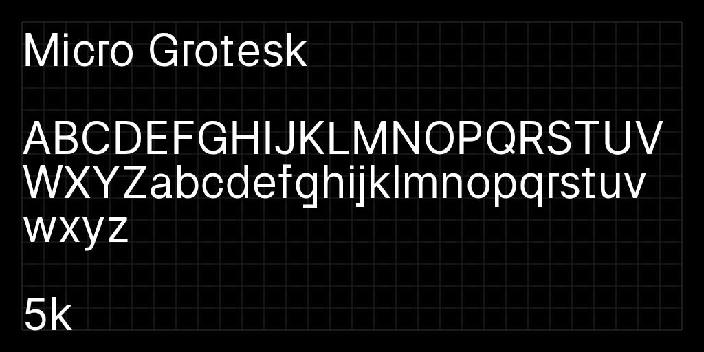

# Micro Grotesk
⚠️ Work in progress: A 256 UPM typeface designed to have a small file size.



## Development

Build scripts and source files are in the [sources](sources) directory.

To build new fonts, open a Unix-like terminal (Linux, MacOS, WSL) in the root directory of this project, and run the build script. If you have [Python3](https://www.python.org/) installed, this script should set up a temporary virtual environment and install all needed dependencies automatically.
```
sh build.sh
```
If you are making a pull request to Google Fonts, add the `-gf` flag and files will be moved to `~/Google/fonts/ofl/..` after building.
```
sh build.sh -gf
```
